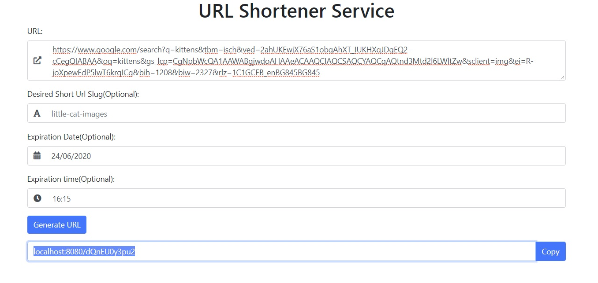

# urlshortener
Url Shortener Service with Go

Design and implement URL-shortener service.

Functional requirements:
 * Given a URL, generate a shorter and unique alias (short link)
 * When users access a short link, redirect to the original link
 * Users should optionally be able to pick a custom short link for their URL
 * Links will expire after a standard default timespan. Users should also be able to specify the expiration time

Non-functional Requirements:
 * Integrate cache like Redis or Memcached for storing the data
 * Shortened links should not be guessable (not predictable)
#### Demo web view:

